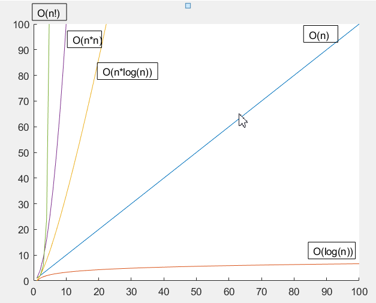

# 算法晋级之路

基于python的算法学习

## 目录
* [查找算法](#查找算法)
    * [简单查找](#简单查找)
    * [二分查找](#二分查找)
    * [大O表示法](#大O表示法)
## 查找算法
学习两种简单查找算法：简单查找和二分查找。  
### 简单查找 
[code](./查找算法/simple_search.py)
其实就是暴力匹配，以此比较库中的元素是否是你要查找的目标，知道找到为止，或者将库中元素遍历完。 因为要遍历所有元素，显然时间复杂度为：

### 二分查找 
[code](./查找算法/binary_search.py)
对于一个有序的列表，可用二分查找快速找到目标值。其原理简单来说就是每次将**目标值**与列表**中间的值**进行比较。因为列表有序，因此每比较一次，就可以排除一半的数据。最后如果找到目标值，则返回其下标，否则返回NULL。每次都可以排除一半的结果，因此时间复杂度为：

### 大O表示法
大O表示法指出了算法有多快。例如假设列表包含n个元素，简单查找需要检查所有的元素，因此需要n步，用大O表示法就是O(n)。没有单位，大O表示法让你能够比较操作数，指出了算法运行时间的**增速**。而使用二分查找只需要执行logn次操作。
