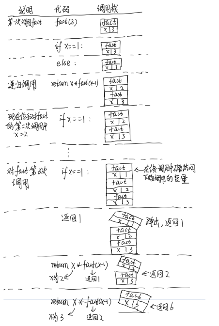
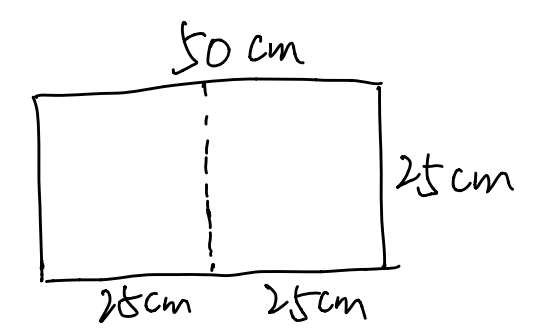
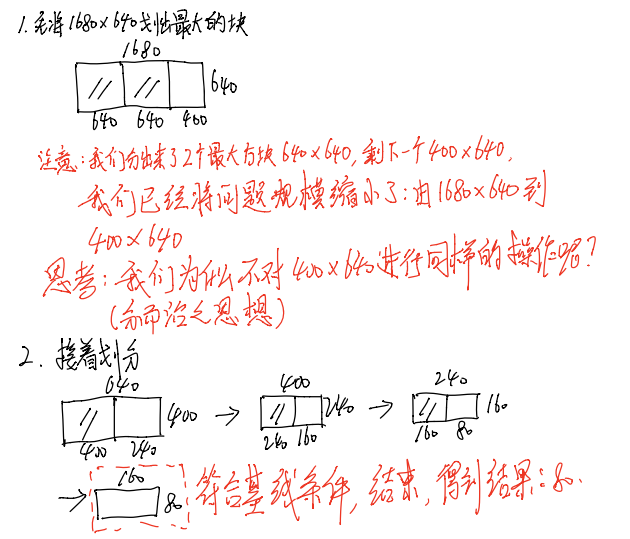

# 算法晋级之路

基于python的算法学习

## 目录
* [查找算法](#查找算法)
    * [简单查找](#简单查找)
    * [二分查找](#二分查找)
    * [大O表示法](#大O表示法)
* [排序算法](#排序算法)
    * [选择排序](#选择排序)
## 查找算法
学习两种简单查找算法：简单查找和二分查找。  

### 简单查找
[code](./查找算法/simple_search.py)
其实就是暴力匹配，依次比较库中的元素是否是你要查找的目标，知道找到为止，或者将库中元素遍历完。 因为要遍历所有元素，显然时间复杂度为：


### 二分查找 
[code](./查找算法/binary_search.py)
对于一个有序的列表，可用二分查找快速找到目标值。其原理简单来说就是每次将**目标值**与列表**中间的值**进行比较。因为列表有序，因此每比较一次，就可以排除一半的数据。最后如果找到目标值，则返回其下标，否则返回NULL。每次都可以排除一半的结果，因此时间复杂度为：


### 大O表示法
大O表示法指出了算法有多快。例如假设列表包含n个元素，简单查找需要检查所有的元素，因此需要n步，用大O表示法就是O(n)。没有单位，大O表示法让你能够比较操作数，指出了算法运行时间的**增速**。而使用二分查找只需要执行log(n)次操作。


## 排序算法
学习两种排序算法：选择排序和快速排序

### 选择排序
* 数组和链表

```
1.数组：内存空间连续
2.链表：元素可存储在内存任何一个位置，因为每个元素都存储了下一个元素的位置
```
区别：  

| # | 数组 | 链表 |
|----|-----|-----|
|`读取`|*O(1)*|*O(n)*|
|`插入`| _O(n)_|*O(1)*|
|`删除`| _O(n)_|*O(1)*|

注意：仅当能够立刻访问到要删除的元素时，操作才为O(1),通常记录链表中的第一个和最后一个元素，当删除它们时，为O(1)

* 选择排序  [code](./排序算法/selectionSort.py)  
选择排序是一种简单的排序算法，思想非常简单：依次从待排序的集合(S)中取出最大的元素放到新的数组/链表中(T)，当S中的元素取完时，T就构成了一个有序的数组/链表，其中的元素按由大到小排列。  
因为每次都要遍历一遍集合S,以找出最大元素，因此算法的复杂度为*O(n^2)*  
```
实现：对数组中的元素按由小到大排列  
输入：S = [5, 10, 7, 3, 99]  
输出：T = [3, 5, 7, 10, 99]  
```

### 快速排序

- 递归

```
简单来讲递归就是程序调用自身。递归可以让问题的解决方案更加的清晰，但是并没有！没有！没有！性能上的优势！
编写递归函数一定一定一定要有基线条件和递归条件。
如果使用循环，程序的性能可能更高；如果使用递归，程序可能更易理解。如何选择取决于什么对你更重要。
```

简单练手：

编写递归函数实现阶乘计算，如输入：3；输出：6

```python
def fact(x):
	if x == 1:		# 基线条件
		return 1
	else:
		return x * fact(x-1)	# 递归条件
```

- 栈

```
程序的执行其实就是在不断的压入栈和弹出栈。当程序在调用另一个程序时，当前程序会暂停并处于未完成的状态。上述程序,运行fact(3)的执行过程如下图所示。
```



- 分而治之思想(D&C)

```
分而治之是一种著名的递归式问题的解决方法，是一种通用的解决问题的思想。
使用D&C解决问题的步骤包括两步：
	(1) 找出基线条件，尽可能简单
	(2) 不断将问题分解，缩小规模，直到符合基线条件
```

简单练手：

1. 用分而治之的思想编程实现：给定一块土地(m x n)，试将该地均匀分成方块，并使方块的面积尽可能大，求方块的边长。如输入：1680 640； 输出：80

```
求解思想：
(1)找基线条件
	思考最简单的情况：什么情况下最易分？
	当一条边是另外一条边的整数倍时，最容易分，方块的边长就是短边长。如下图所示：
```



```
(2)找递归条件，将问题的规模缩小，思想如下。(用到的数学知识：欧几里得算法(辗转相除法))数学还是很重要滴！
```



编程实现：

```python
def find_max_square(length, width):
    """
    找出土地均匀划分的最大方块
    """
    # 判断输入是否合法
    if length == 0 or width == 0:
        print("输入不合法，请检查输入！")
        return 0
    
    temp = 0
    # 判断最长边
    if length < width:
        temp = length
        length = width
        width = temp
    
    result = length % width 
    print(result)
    if result == 0:     # 基线条件
        return width
    else:
        return find_max_square(width, result)	# 递归条件
```

2. 递归求解列表元素的和。例如：输入：arr = [1, 2, 3, 4],  输出：sum = 10

​      小技巧：在编写涉及到数组的递归函数时，基线条件通常是数组为空或者只包含一个元素！

```python
def sum_arr(arr):
    # 前提，列表非空
    if len(arr)  == 0:
        return "列表为空！" 
    # 基线条件
    if len(arr) < 2:
        return arr[0]
    else:
        # 递归条件，缩小规模
        return arr[0] + sum_arr(arr[1:])
```

3.  递归计算列表中包含的元素个数。例如：输入arr = [1,2], 输出：num = 2

   ```python
   def num_arr(arr):
       # 基线条件
       if arr == []:
           return 0
       else:
           # 递归
           return 1 + num_arr(arr[1:])
   ```

4. 递归找出列表中最大的数

   ```python
   def findmax2(arr):
       # 前提
       if arr == []:
           return "错误，列表为空！"
       # 基线条件
       if len(arr) < 2:
           return arr[0]
       else:
           # 递归
           sub_max = findmax2(arr[1:])
           return arr[0] if arr[0] > sub_max else sub_max
   ```

- 快速排序

```
快速排序是常用的排序算法，比选择排序快的多，C语言中的qsort实现的就是快速排序。
快速排序步骤：
	1.找基准值
	2.分区：小于基准，基准，大于基准
	3.对各区域进行快速排序
```

```python
def quicksort(arr):
    '''快速排序'''
    if len(arr) < 2:    # 基线条件：为空或只包含一个元素的数组有序
        return arr

    else:
        pivot = arr[0]  # 递归
        less = [i for i in arr[1:] if i <= pivot]   # 小于基准的区,取等号是防止有与基准相同的值
        greater = [i for i in arr[1:] if i > pivot]

        return quicksort(less) + [pivot] + quicksort(greater)
```

- 再谈大O

在大O表示法中，*O(n)*中的n实际上指的是c*n,其中c表示算法所需的固定时间常量。我们在比较算法时通常是不考虑这个量的，因为**如果两种算法的大O时间不同，c的大小将无关紧要**。

但是，当大O相同时，c就有作用了。还有一种排序算法为**合并排序**的算法时间复杂度为*O(nlog(n))*, 但我们还是常用**快速排序**算法，虽然它的平均时间复杂度才是*O(nlog(n))*,就是因为它们的**c不同**。

